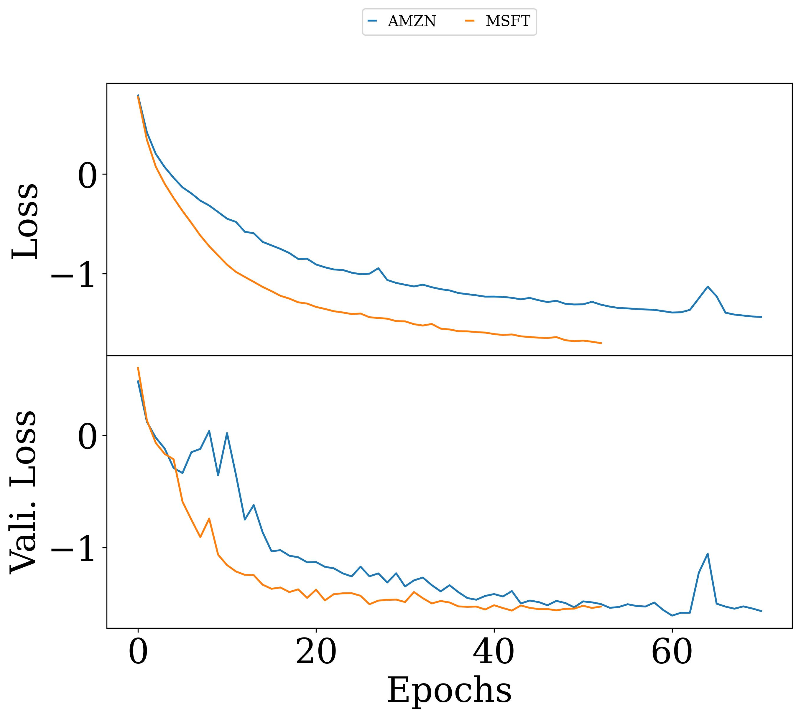
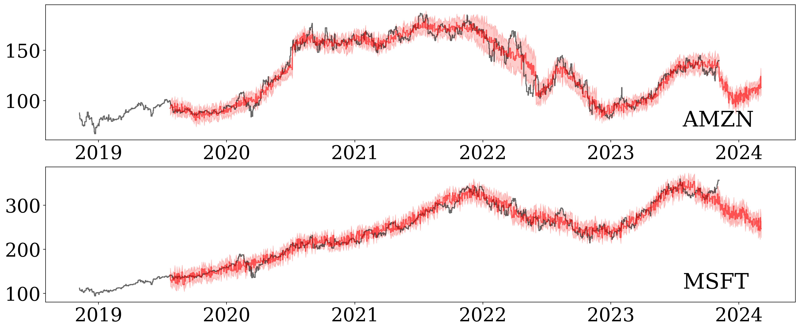

# DISCLAIMER: 
Stock market predictions and financial analyses provided by this code are for informational purposes only and should not be considered as investment advice. The information, analyses, and predictions generated by this code are based on historical data, technical indicators, and machine learning models, which do not guarantee future performance or accuracy.

Use of this code and any decision made based on its output is at your own risk. Trading and investing in the financial markets involves significant risk, and it's important to conduct thorough research, exercise caution, and consider seeking advice from a qualified financial advisor before making any investment decisions.

The author(s) of this code are not responsible for any financial losses, gains, or decisions made based on the information provided by this code. Past performance is not indicative of future results, and predictions made by this code may not be accurate or reliable.

This code is provided as-is without any warranty. Users are solely responsible for their own decisions and actions taken based on the information obtained from this code.

Please perform your own due diligence and be aware of the risks involved in financial markets before making any investment decisions.

# Stock market predictions using Bayesian LSTM networks

The main idea behind this repo is to predict stock market up to several weeks in advance using daily trends. It combines differents stock from a one sector into one combined model. This serves as a starting point to train each stock indivudually. End results are far better that predictions from a single stock.

# Example Usage all options

usage: main.py [-h] [--tickers [TICKERS ...]] [--start_date START_DATE] [--end_date END_DATE] [--validation_days VALIDATION_DAYS] [--epochs EPOCHS] [--layers LAYERS]
               [--input_time_steps INPUT_TIME_STEPS] [--output_time_steps OUTPUT_TIME_STEPS] [--batch_size BATCH_SIZE] [--lr LR] [--output_dir OUTPUT_DIR]

# output from the following command
python main.py --tickers 'AMZN' 'MSFT' --epochs 1000 --output_dir new

# stocks for data download from yahoo fianance
tickers =  ['AMZN', 'MSFT']  
dates (start, end, validation) 2018-11-08 2023-11-07 2022-11-07  
epochs, lr, batch_size layers =  1000 1e-04 32 4  
time steps (input, output) =  120 120  

 
Directory 'new/' created successfully.
# Downloading the data fron yahoo finanace 
[*********************100%%**********************]  1 of 1 completed 
new/AMZN.csv 
[*********************100%%**********************]  1 of 1 completed 
new/MSFT.csv 

# information for training and validation samples
Train all stocks as one combined model but training in sequentially.. 
new/AMZN.csv 
train dataset <bound method DataFrame.info of 

| index |Date   |     Open    |    High     |    Low     |  Close  | Adj Close |     Volume|
| -------- | -------- | -------- | -------- | -------- | -------- | -------- | -------- |
|0     |2018-11-08|   87.750000   |89.199997   |86.255501   |87.745499   |87.745499  |130698000|
|1004  |2022-11-04|   91.489998   |92.440002   |88.040001   |90.980003   |90.980003  |129101300|

[1005 rows x 7 columns]> 
test dataset <bound method DataFrame.info of 

| index |Date   |     Open    |    High     |    Low     |  Close  | Adj Close |     Volume|
| -------- | -------- | -------- | -------- | -------- | -------- | -------- | -------- |
| 1005 |  2022-11-07 |  91.949997 |   92.099998 |  89.040001 |   90.529999 |   90.529999 |   77495700 |
| 1255 |  2023-11-06 |  138.759995|  140.729996 | 138.360001 | 139.740005 | 139.740005 |  44928800 |

[251 rows x 7 columns]> 
train/val samples  (1016, 120, 5) (1016, 120) (11, 120, 5) (11, 120) 

# Model summary, using same architecture for each stock
Model: "model"
_________________________________________________________________
 Layer (type)                Output Shape              Param #   
=================================================================
 input_1 (InputLayer)        [(None, 120, 5)]          0         
                                                                 
 LSTMLayer1 (Bidirectional)  (None, 120, 240)          120960    
                                                                 
 LSTMLayer2 (Dropout)        (None, 120, 240)          0         
                                                                 
 LSTMLayer3 (Bidirectional)  (None, 120, 240)          346560    
                                                                 
 LSTMLayer4 (Dropout)        (None, 120, 240)          0         
                                                                 
 LSTMLayer5 (Bidirectional)  (None, 120, 240)          346560    
                                                                 
 LSTMLayer6 (Dropout)        (None, 120, 240)          0         
                                                                 
 LSTMLayer7 (Bidirectional)  (None, 240)               346560    
                                                                 
 LSTMLayer8 (Dropout)        (None, 240)               0         
                                                                 
 dense (Dense)               (None, 240)               57840     
                                                                 
 dist (DistributionLambda)   ((None, 120),             0         
                              (None, 120))                       
                                                                 
=================================================================
Total params: 1,218,480
Trainable params: 1,218,480
Non-trainable params: 0
_________________________________________________________________

# Training for a combined model using sotcks data one by one 

new/AMZN.csv 

Epoch 1/1000 
32/32 [==============================] - ETA: 0s - loss: 0.7893   
Epoch 00001: val_loss improved from inf to 0.48532, saving model to new/models/combined_model 
32/32 [==============================] - 19s 376ms/step - loss: 0.7893 - val_loss: 0.4853 
Epoch 00138: val_loss did not improve from -1.94774 
32/32 [==============================] - 8s 247ms/step - loss: -1.7516 - val_loss: -1.9223 
ticker  AMZN 18.334947760899862 [min] 

new/MSFT.csv 

Epoch 1/1000 
32/32 [==============================] - ETA: 0s - loss: 0.7833   
Epoch 00001: val_loss improved from inf to 0.63809, saving model to new/models/combined_model 
32/32 [==============================] - 19s 393ms/step - loss: 0.7833 - val_loss: 0.6381 
Epoch 00127: val_loss did not improve from -1.96847
32/32 [==============================] - 20s 619ms/step - loss: -2.0032 - val_loss: -1.8286
ticker  MSFT 18.21367576519648 [min]

# Now train each model again using combined model as a starting point.  
new/AMZN.csv  

Epoch 1/1000  
32/32 [==============================] - ETA: 0s - loss: 0.7902     
Epoch 00001: val_loss improved from inf to 0.47873, saving model to new/models/AMZN_model  
32/32 [==============================] - 55s 1s/step - loss: 0.7902 - val_loss: 0.4787  
Epoch 00071: val_loss did not improve from -1.60603  
32/32 [==============================] - 8s 249ms/step - loss: -1.4368 - val_loss: -1.5653  
new/models/AMZN_model  
input shape  (10, 120, 5)  

predicting using model file new/models/AMZN_model  
prediction file name  new/AMZN_pred.npy  
ticker  AMZN 23.703207035859425 [min]  
new/MSFT.csv  

_________________________________________________________________  
Epoch 1/1000  
32/32 [==============================] - ETA: 0s - loss: 0.7749    
Epoch 00001: val_loss improved from inf to 0.59853, saving model to new/models/MSFT_model  
32/32 [==============================] - 20s 417ms/step - loss: 0.7749 - val_loss: 0.5985  

